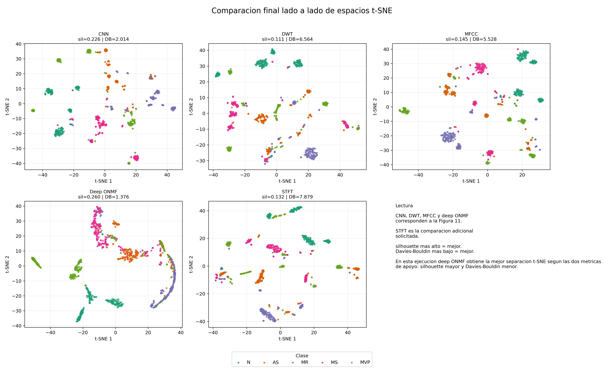
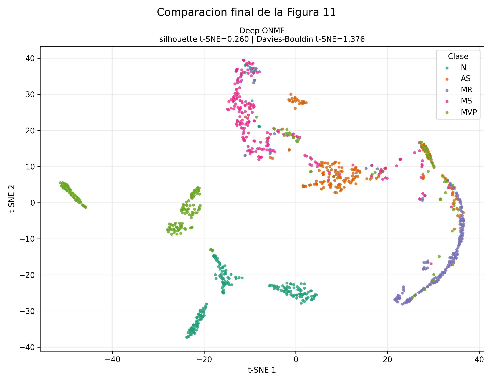
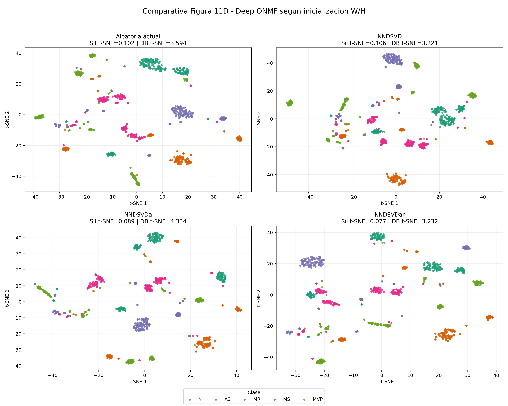
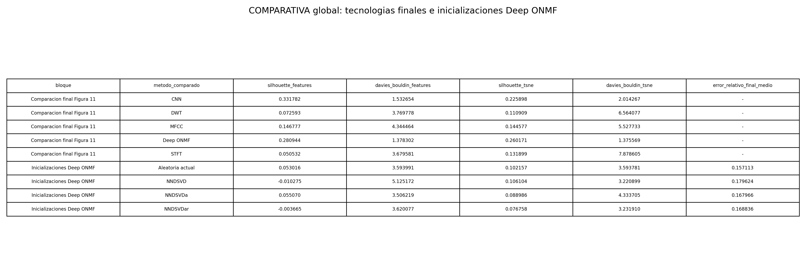

# COMPARATIVA

## Que compara este documento

Este documento junta dos niveles de comparacion:

1. La comparacion final de Figura 11 entre CNN, DWT, MFCC, Deep ONMF optimizado y STFT.
2. La prueba pedida por Juan para Deep ONMF con inicializaciones NNDSVD, NNDSVDa y NNDSVDar, manteniendo tambien la inicializacion aleatoria actual como referencia.

No son exactamente la misma prueba: la primera compara tecnologias completas y la segunda compara solo la forma de inicializar W y H dentro de Deep ONMF. Aun asi, juntas sirven para explicar que se queda como resultado principal y que inicializacion conviene estudiar.

## Tabla global

| bloque | metodo_comparado | silhouette_features | davies_bouldin_features | silhouette_tsne | davies_bouldin_tsne | error_relativo_final_medio | nota |
| --- | --- | --- | --- | --- | --- | --- | --- |
| Comparacion final Figura 11 | CNN | 0.331782 | 1.532654 | 0.225898 | 2.014267 | - | CNN gana en silhouette de rasgos, pero no en t-SNE. |
| Comparacion final Figura 11 | DWT | 0.072593 | 3.769778 | 0.110909 | 6.564077 | - | Representacion wavelet clasica; queda por debajo en t-SNE. |
| Comparacion final Figura 11 | MFCC | 0.146777 | 4.344464 | 0.144577 | 5.527733 | - | Rasgos cepstrales; mejora a DWT/STFT en silhouette t-SNE, pero no a Deep ONMF. |
| Comparacion final Figura 11 | Deep ONMF | 0.280944 | 1.378302 | 0.260171 | 1.375569 | - | Deep ONMF optimizado: resultado principal del TFG. |
| Comparacion final Figura 11 | STFT | 0.050532 | 3.679581 | 0.131899 | 7.878605 | - | Espectro base; muchos rasgos y peor Davies-Bouldin t-SNE. |
| Inicializaciones Deep ONMF | Aleatoria actual | 0.053016 | 3.593991 | 0.102157 | 3.593781 | 0.157113 | Referencia actual: mejor error de reconstruccion. |
| Inicializaciones Deep ONMF | NNDSVD | -0.010275 | 5.125172 | 0.106104 | 3.220899 | 0.179624 | Mejor inicializacion para la foto t-SNE entre las tres propuestas. |
| Inicializaciones Deep ONMF | NNDSVDa | 0.055070 | 3.506219 | 0.088986 | 4.333705 | 0.167966 | Mejor separacion en rasgos SBV entre inicializaciones, pero peor t-SNE que NNDSVD. |
| Inicializaciones Deep ONMF | NNDSVDar | -0.003665 | 3.620077 | 0.076758 | 3.231910 | 0.168836 | Parecida a NNDSVD en Davies-Bouldin t-SNE, pero peor silhouette t-SNE. |

## Figuras comparativas

### Comparacion final de tecnologias

### Deep ONMF optimizado dentro de la comparacion final

### Inicializaciones Deep ONMF

### Tabla visual

## Que metodo se queda

Para el resultado principal del TFG se debe mantener **Deep ONMF optimizado**.

- En la comparacion final, el mejor `silhouette_tsne` es **Deep ONMF** con `0.260171`.
- En la comparacion final, el mejor `davies_bouldin_tsne` es **Deep ONMF** con `1.375569`.
- En la comparacion final, el mejor `silhouette_features` es **CNN** con `0.331782`.

La lectura importante es esta: **CNN separa mejor en una metrica del espacio de rasgos original**, pero **Deep ONMF optimizado gana en la representacion visual t-SNE y en Davies-Bouldin**, que es lo que mas se conecta con la Figura 11.

## Que inicializacion conviene destacar

Entre las inicializaciones pedidas por Juan, la mas interesante es **NNDSVD**.

- Mejor `silhouette_tsne` entre inicializaciones: **NNDSVD** con `0.106104`.
- Menor `davies_bouldin_tsne` entre inicializaciones: **NNDSVD** con `3.220899`.
- Mejor `silhouette_features` entre inicializaciones: **NNDSVDa** con `0.055070`.
- Menor error de reconstruccion: **Aleatoria actual** con `0.157113`.

Esto significa que **NNDSVD mejora la foto t-SNE frente a la inicializacion aleatoria**, aunque la inicializacion aleatoria reconstruye con menos error. No hay contradiccion: reconstruir mejor la matriz X no siempre implica separar mejor las clases en la visualizacion.

## Explicacion comparativa entre ellas

### Aleatoria actual

Es la referencia de partida. Tiene el menor error de reconstruccion, por lo que ajusta bien los espectrogramas. Su punto debil es que la separacion t-SNE queda por debajo de NNDSVD.

### NNDSVD

Arranca W y H usando una estructura extraida por SVD. Aunque su error de reconstruccion medio es mayor que el aleatorio, consigue la mejor separacion visual t-SNE entre las inicializaciones. Es la opcion mas defendible si Juan pregunta por inicializaciones comunes.

### NNDSVDa

Rellena los ceros de NNDSVD con la media de X. Mejora ligeramente el `silhouette_features` frente a la aleatoria, pero empeora la foto t-SNE. Puede ayudar a evitar ceros, pero aqui no es la mejor visualmente.

### NNDSVDar

Rellena los ceros con ruido pequeno. En esta prueba no supera a NNDSVD ni a la aleatoria en las metricas principales. Queda como variante explorada, no como candidata principal.

### Deep ONMF optimizado

Es el resultado que se debe presentar como linea principal del TFG porque en la comparacion global obtiene la mejor separacion t-SNE y el mejor Davies-Bouldin t-SNE. Las inicializaciones de Juan sirven como prueba adicional para mejorar el arranque de W y H, no para sustituir automaticamente la comparacion optimizada.

## Conclusion para explicar a Juan

La prueba muestra que **NNDSVD es la mejor de las tres inicializaciones propuestas para mejorar la visualizacion t-SNE de Deep ONMF**. Sin embargo, el resultado global que se mantiene como mejor para el TFG es **Deep ONMF optimizado**, porque frente a CNN, DWT, MFCC y STFT presenta la separacion t-SNE mas clara y el menor Davies-Bouldin en t-SNE.
